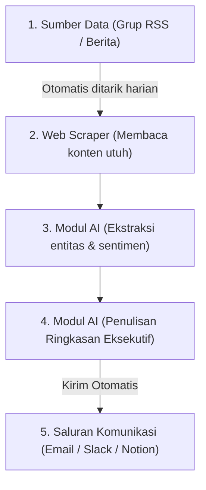

## Mengapa Bertanya pada AI Saja Tidak Cukup

Sebagian besar dari kita menggunakan kecerdasan buatan (AI) dengan cara yang sangat sederhana: membuka peramban, mengetik pertanyaan di kolom obrolan ChatGPT atau Claude, membaca jawabannya, lalu menyalin hasilnya ke dokumen kerja kita.

*Sumber visual: Wikimedia Commons / Thomas Schanz (CC BY-SA 3.0)*

Cara ini memang membantu untuk tugas-tugas instan. Namun, jika Anda menggunakan AI secara berulang-ulang untuk alur kerja yang sama setiap hari—misalnya merangkum laporan berita harian, memilah surel masuk, menyusun draf laporan, atau menerjemahkan dokumen berkala—melakukan tanya-jawab manual secara terus-menerus adalah pemborosan waktu.

Di sinilah pentingnya memahami konsep **Workflow AI (Alur Kerja AI)**.

Alih-alih memperlakukan AI sebagai lawan bicara dalam obrolan kasual, kita memperlakukannya sebagai sebuah komponen dalam jalur produksi industri. Kita menghubungkan masukan (input) dari satu proses, memprosesnya menggunakan model AI dengan parameter tertentu, lalu menyalurkan hasilnya ke proses berikutnya secara otomatis tanpa keterlibatan manual manusia di setiap tahapannya.

Dengan membangun Workflow AI yang tepat, Anda dapat memangkas waktu kerja rutin dari hitungan jam menjadi hitungan menit saja, meningkatkan konsistensi hasil kerja, dan membebaskan pikiran Anda untuk fokus pada tugas-tugas kreatif yang membutuhkan intuisi manusiawi.

---

## Apa itu Workflow AI?

Secara sederhana, Workflow AI adalah rangkaian proses terstruktur yang menggabungkan satu atau beberapa tugas berbasis kecerdasan buatan dengan sistem digital lainnya.

Dalam alur kerja konvensional, manusia bertindak sebagai "perekat" yang menghubungkan antar aplikasi (misalnya mengunduh berkas PDF dari email, menyalin teksnya, memasukkannya ke penerjemah, lalu mengetik hasilnya ke dokumen Word). Dalam Workflow AI, semua proses penghubung ini ditangani oleh sistem otomatis (pipeline), sementara AI bertugas melakukan transformasi data, penalaran, atau pembuatan teks di tengah-tengah alur tersebut.

Mari kita lihat dua contoh penerapan praktis Workflow AI yang dapat Anda implementasikan untuk mendongkrak produktivitas harian Anda.

---

## Contoh Workflow 1: Otomatisasi Riset Pasar dan Pembuatan Ringkasan Laporan

Bagi para profesional di bidang pemasaran, analis bisnis, akademisi, atau manajer produk, memantau pergerakan tren pasar dan menganalisis laporan kompetitor adalah makanan sehari-hari.

Biasanya, proses ini melibatkan aktivitas membaca puluhan artikel berita atau dokumen PDF panjang, mencatat poin penting, lalu menyusunnya menjadi ringkasan mingguan.

Dengan Workflow AI, Anda dapat mengotomatiskan seluruh alur riset tersebut dengan skema seperti berikut:

1.  **Pengumpulan Sumber (Trigger):** Sistem otomatis memantau feed RSS dari media industri pilihan Anda, grup obrolan tertentu, atau folder Google Drive tempat laporan PDF disimpan.
2.  **Ekstraksi Konten (Web Scraping):** Begitu ada artikel baru, sistem membaca isi konten secara penuh dan membersihkan elemen-elemen iklan atau menu web yang mengganggu.
3.  **Ekstraksi Entitas & Klasifikasi (AI Tahap 1):** AI membaca teks bersih tersebut dan mengklasifikasikannya ke dalam topik-topik tertentu (misalnya: _Keuangan, Teknologi, Kompetitor_), lalu mengekstrak poin penting berupa angka statistik, nama tokoh, dan nama perusahaan.
4.  **Generasi Ringkasan Eksekutif (AI Tahap 2):** AI menyusun ringkasan pendek berformat Markdown yang memuat latar belakang, dampak terhadap industri, dan rekomendasi aksi.
5.  **Penyimpanan & Notifikasi (Action):** Hasil ringkasan otomatis diunggah ke basis pengetahuan internal perusahaan (seperti Notion atau Obsidian) dan sistem mengirimkan notifikasi ke Slack tim riset.

Dengan alur ini, Anda hanya perlu membuka papan Notion mingguan untuk membaca ringkasan riset yang terstruktur rapi, tanpa harus menyaring ratusan artikel berita secara manual.

---

## Contoh Workflow 2: Alur Pembuatan Konten Edukatif dari Transkrip Video

Jika Anda seorang pembuat konten (content creator), pendidik, atau pemasar digital, Anda mungkin sering ingin mengubah rekaman video presentasi, kuliah umum, atau webinar menjadi tulisan blog atau utas media sosial yang menarik.

Proses manualnya sangat melelahkan: mendengarkan video, menulis transkrip, mengedit bahasa lisan menjadi bahasa tulisan yang formal, dan merumuskan ulang poin pentingnya.

Workflow AI dapat menyederhanakan alur tersebut secara instan:

1.  **Pengunggahan Video/Audio:** Anda mengunggah berkas rekaman webinar ke folder khusus di Dropbox.
2.  **Otomatisasi Transkripsi (Whisper AI):** Sistem mendeteksi adanya berkas baru, mengirimkannya ke API transkripsi suara-ke-teks (seperti OpenAI Whisper), dan menghasilkan teks transkrip mentah.
3.  **Penyelarasan Teks (AI Tahap 1):** AI membaca transkrip mentah yang penuh dengan jeda bicara (_"hmmm"_, _"anu"_, repetisi kata) dan merapikannya menjadi teks bahasa Indonesia yang formal, teratur, dan mudah dibaca tanpa mengubah makna aslinya.
4.  **Pemecahan Konten (AI Tahap 2):** AI memecah dokumen tersebut menjadi beberapa draf aset tulisan yang siap dipublikasikan:
    - Satu draf artikel blog lengkap beserta judul dan daftar poin utama.
    - Tiga draf utas (thread) informatif untuk diposting di platform sosial X/Twitter.
    - Naskah ringkas untuk video vertikal berdurasi 60 detik (TikTok/Reels).
5.  **Pengarsipan:** Semua draf di atas disimpan dalam basis data editor sehingga Anda tinggal melakukan proses penyuntingan akhir (_review & polish_) sebelum dipublikasikan.

---

## Manfaat Mengotomatiskan Pekerjaan Repetitif

Mengapa Anda harus meluangkan waktu di awal untuk membangun alur kerja otomatis seperti ini?

- **Penyelamatan Waktu Fokus:** Menghilangkan keharusan menyalin teks antar-aplikasi berkali-kali memberikan Anda energi pikiran untuk fokus pada analisis kritis dan strategi kreatif tingkat tinggi.
- **Kecepatan Produksi:** Proses pengolahan data yang biasanya membutuhkan waktu berhari-hari kini dapat diselesaikan dalam hitungan detik.
- **Konsistensi Standar:** AI yang diberi template instruksi (prompt) yang ketat akan selalu menghasilkan output dengan gaya bahasa, format, dan struktur yang seragam di setiap laporan.

---

## Cara Memulai Membangun Workflow AI Sendiri

Anda tidak perlu menjadi seorang programmer mahir untuk mulai mengotomatiskan pekerjaan Anda menggunakan AI. Saat ini, banyak platform tanpa kode (no-code platforms) yang menyediakan modul integrasi kecerdasan buatan secara visual:

- **Make.com dan Zapier:** Layanan otomatisasi ramah pengguna yang memungkinkan Anda menghubungkan ribuan aplikasi (seperti Gmail, Google Sheets, Trello) dengan API kecerdasan buatan (seperti OpenAI, Claude) hanya dengan menghubungkan kotak-kotak alur kerja secara visual.
- **n8n.io:** Pilihan open-source yang sangat andal dan hemat biaya jika Anda ingin memasang sistem otomatisasi sendiri (self-hosted) dengan integrasi AI yang sangat mendalam dan fleksibel.
- **Skrip Python Sederhana:** Jika Anda memiliki sedikit dasar pemahaman pemrograman, menulis skrip Python pendek menggunakan library seperti LangChain atau langsung memanggil SDK resmi penyedia model adalah cara paling hemat biaya dan fleksibel untuk kebutuhan otomatisasi tingkat lanjut.

## Kesimpulan

Kecerdasan Buatan akan memberikan dampak produktivitas maksimal ketika kita memperlakukannya sebagai bagian dari alur kerja otomatis, bukan sekadar alat obrolan satu arah. Dengan mulai merancang Workflow AI yang mapan untuk aktivitas rutin Anda, Anda tidak hanya menghemat waktu berjam-jam setiap minggunya, tetapi juga membangun infrastruktur digital yang mendukung perkembangan produktivitas jangka panjang Anda.

---

### Mengapa Ini Penting: Telaah Analitis & Implikasi Sistem
Bagi pengembang, arsitek sistem, dan profesional komputasi, pemahaman mendalam mengenai arsitektur dan efisiensi sistem ini memberikan keunggulan kompetitif dalam merancang alur kerja yang tangguh, hemat sumber daya, dan terukur.

---

### Rujukan Primer & Rantai Provenance
1. **Rujukan Primer Standar:** IEEE Computer Society Technical Specifications & JEDEC Standards.
2. **Media Sekunder Terverifikasi:** AnandTech, Tom's Hardware, and ACM Digital Library Computing Reviews.
